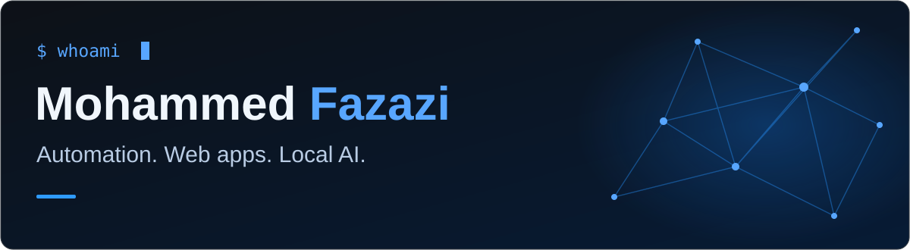

  

Building practical tools that turn repetitive work into simple workflows.

## `$ whoami`

I'm Mohammed. I build automations, web applications, and tools powered by local AI.

- **Automation** — connecting tools and simplifying repetitive processes with UiPath and n8n.
- **Web development** — building practical applications with React and PHP.
- **Local AI** — developing Lino, a desktop assistant powered by Ollama.

## `$ stack`

## `$ projects`

<table>
  <tr>
    <td width="50%" valign="top">
      <h3><a href="https://fazasolutions.com">FazaSolutions ↗</a></h3>
      
Automation and web solutions for everyday business workflows.

      Automation · Web development
    </td>
    <td width="50%" valign="top">
      <h3><a href="https://github.com/MFazazi/Lino">Lino ↗</a></h3>
      
A local desktop assistant for Windows, with voice interaction and tools to perform actions.

      Local AI · Ollama · Desktop assistant
    </td>
  </tr>
  <tr>
    <td width="50%" valign="top">
      <h3>JIFOOD</h3>
      
A PHP application for restaurant management, with a focus on practical workflows and usability.

      PHP · Restaurant management
    </td>
    <td width="50%" valign="top">
      <h3>KIDOO</h3>
      
Learning experiences for children, with free and premium content.

      Education · Freemium
    </td>
  </tr>
</table>

## `$ connect`

**[fazasolutions.com ↗](https://fazasolutions.com)**

<!-- Project names describe work, not necessarily public repositories. Add repository links when they are ready to share. -->
